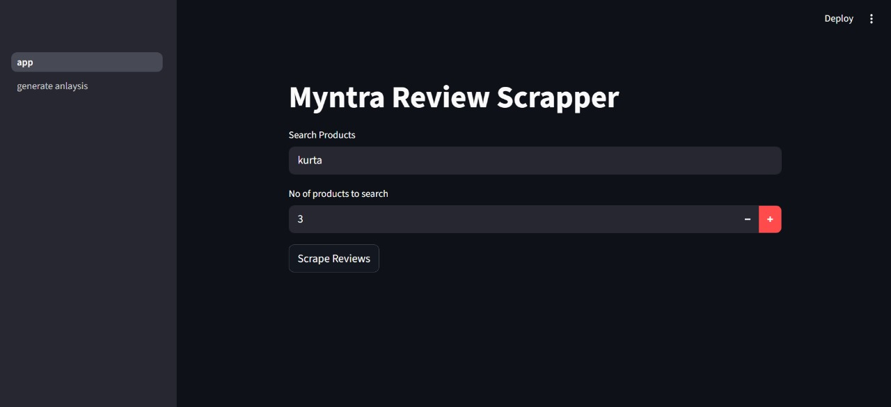
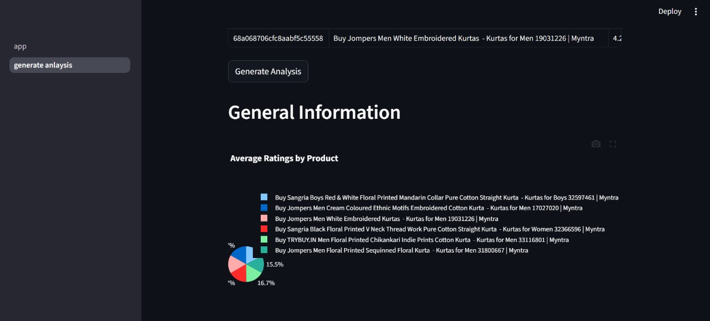
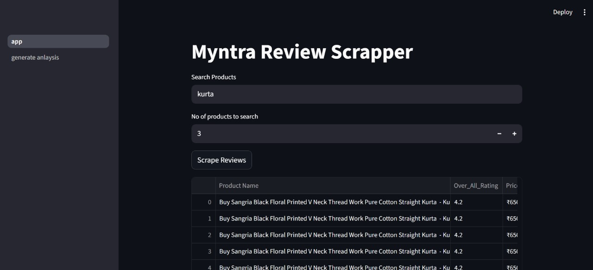

# 🛍️ Myntra Product Review Analyzer

A **Streamlit-based dashboard** that scrapes product reviews from Myntra, stores them in MongoDB, and generates **interactive analysis** using Plotly.

---

## 🚀 Features
- 🔍 **Scraping**: Automatically scrape reviews from Myntra (via `src/scrapper/`).
- ☁️ **Cloud Storage**: Save and fetch reviews from MongoDB (`src/cloud_io/`).
- 📊 **Analysis Dashboard**:
  - General insights: ratings & price distributions
  - Product-specific sections with top positive/negative reviews
  - Interactive charts using Plotly
- 🖥️ **Streamlit UI** for easy visualization

---

## 📂 Project Structure

```
myntra_project/
│── app.py # Main Streamlit app entry point
│── mytra.ipynb # Notebook version for quick experiments
│── requirements.txt # List of dependencies
│── setup.py # Setup for packaging
│── README.md # Documentation
│
│── database_connect/ # Contains DB connection setup
│
│── pages/ # Streamlit multipage app logic
│ └── generate_analysis.py # Page to run data analysis & visualization
│
│── src/ # Core source code
│ ├── cloud_io/ # MongoDB interaction
│ │ └── mongo_io.py # Class for reading/writing reviews in MongoDB
│ │
│ ├── constants/ # Project constants
│ │ └── init.py # Keys, config values (e.g., session keys)
│ │
│ ├── data_report/ # Data analysis & reporting
│ │ └── generate_data_report.py # DashboardGenerator class (charts, summaries, sections)
│ │
│ ├── scrapper/ # Scraping logic
│ │ └── scrapper.py # Scrapes Myntra product reviews
│ │
│ ├── utils/ # Utility functions
│ │ └── helper.py # Reusable helper methods
│ │
│ ├── exception.py # Custom exception handler
│ └── init.py
│
│── static/css/ # Custom CSS for Streamlit styling
│── templates/ # Optional HTML templates
│
│── screenshots/ # Screenshots for documentation
│ ├── dashboard.png
│ ├── generate_analysis.png
│ └── scrapped_data.png

```

---

## ⚙️ Installation

1. Clone the repository:
   ```bash
   git clone https://github.com/YOUR_USERNAME/myntra_project.git
   cd myntra_project

## Create a virtual environment & install dependencies:
python -m venv venv
source venv/bin/activate   # Linux/Mac
venv\Scripts\activate      # Windows

pip install -r requirements.txt

## Configure your MongoDB connection inside src/cloud_io/mongo_io.py.

## ▶️ Usage

Run the Streamlit app:

streamlit run app.py

## Workflow:

- Scrape Product Reviews – Collect reviews from Myntra using the scraper.
- Store Data in MongoDB – Reviews are saved for persistence.
- Generate Analysis – The dashboard visualizes:
- Average rating by product
- Average price comparison
- Top positive & negative reviews
- Rating distribution

## 📊 Example Dashboard

- 📈 Pie Chart: Average Ratings by Product

- 📊 Bar Chart: Price Comparison

- 🌟 Positive Reviews: Top 5 comments with highest ratings

- 💢 Negative Reviews: Top 5 comments with lowest ratings

- 🔹 Rating Counts: Distribution of ratings (1–5 stars)

## 📸 Screenshots

### 🔹 Dashboard Home


### 🔹 General Information


### 🔹 Product Section



## 🛠️ Tech Stack
```
Python
Streamlit – UI framework
MongoDB – Cloud data storage
Plotly – Interactive charts
Pandas – Data wrangling
BeautifulSoup/Requests – Web scraping

```

## 🚧 Future Enhancements
```
Multi-site support (Amazon, Flipkart, etc.)
NLP-based sentiment analysis
Export reports (PDF/Excel)
Automated scheduling of scrapes
```

## 👨‍💻 Author
```
Developed by Jayant ✨
Feel free to contribute or raise issues!
```

